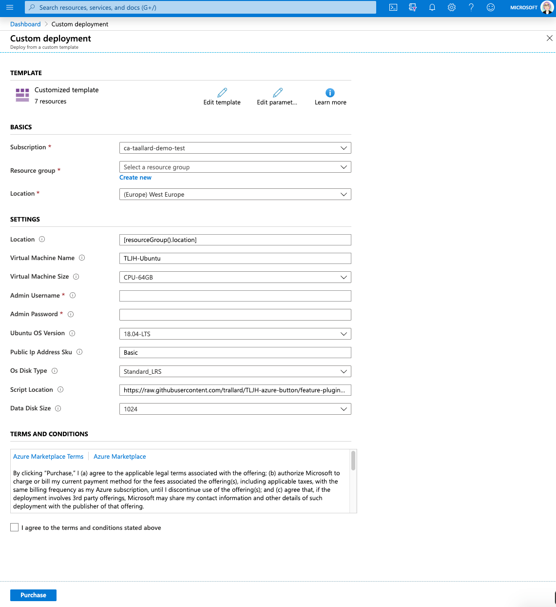

# The Littlest JupyterHub Azure button deploy

## What do you need?
You will need an Azure account to be able to spin your JupyterHub. 

:star: You can get a free acount with 150pounds worth of credit folling 👉🏼 [this link](https://azure.microsoft.com/free/?WT.mc_id=TLJHbutton-github-taallard)

## What in in this repo?

This repository contains the ARM (Azure Resource Manager) template for the Littlest JupyterHub deployment. Allowing you to deploy a vanilla Littlest JupyterHub by clicking on the deploy to Azure blue button here.

## 💻 How does the Deploy on Azure button work?
The ARM template contains all the basic configuration needed to deploy a your own  Littlest JupyterHub on Azure. 

The ARM template follows the configuration detailed in [https://the-littlest-jupyterhub.readthedocs.io/en/latest/install/azure.html](https://the-littlest-jupyterhub.readthedocs.io/en/latest/install/azure.html). But it reduces some of the friction by eliminating the need to create resources manually using the Azure portal.

To deploy your TLJH follow these steps:

1. Create an Azure account. 
2. Click on the `Deploy to Azure` button at the top of the Readme. This will redirect you to the Azure portal login page.
3. Login to your account.
4. Fill in the details in the next screen

- **subscription**: choose the subscription you want to use (e.g. Free Trial)
- **Resource group**: this will keep all of our resources together. If you have never created a resource group click on `Create new` and give it a meaningful name (e.g. jupyter-resources)
- **Location**: this is the Azure region where all your resources will be located (e.g. WestEurope, you can check all the available regions [here](https://azure.microsoft.com/global-infrastructure/services/?products=virtual-machines&WT.mc_id=TLJHbutton-github-taallard))
- **Virtual Machine Name**: the name for your virtual machine
- **Virtual Machine Size**: this will be determined by the workload. You can check the list of available VM sizes [here](https://docs.microsoft.com/azure/virtual-machines/linux/sizes-general?WT.mc_id=TLJHbutton-github-taallard)
- **Admin UserName**: this will be the root user and is needed for the management of your TLJH
- **Admin password**: choose a secure password for your root user
- **OS Disk Type**: you have the options Standard HDD (LRS), Standard SSD and Premium SSD (for more details see [the docs](https://docs.microsoft.com/azure/virtual-machines/windows/disks-types?WT.mc_id=TLJHbutton-github-taallard))
- **Data Disk Size**: the size of your Data disk size (for more details [visit the docs](https://docs.microsoft.com/azure/virtual-machines/windows/disks-types?WT.mc_id=TLJHbutton-github-taallard))

## :thinking: What is the Littlest JupyterHub?
A simple JupyterHub distribution for a small (1-100) number of users on a single server. You can find more info about it in the official docs 👉🏼
[https://the-littlest-jupyterhub.readthedocs.io/en/latest/index.html](https://the-littlest-jupyterhub.readthedocs.io/en/latest/index.html)

## :book: Resources
Here are some links that you might find useful when using the contents in this repo.

- [Azure Resource Manger templates docs](https://docs.microsoft.com/azure/azure-resource-manager/template-deployment-overview?WT.mc_id=TLJHbutton-github-taallard)
- [The Littlest JupyterHub docs](https://the-littlest-jupyterhub.readthedocs.io/en/latest/index.html) 
- [VM available regions](https://azure.microsoft.com/global-infrastructure/services/?products=virtual-machines&WT.mc_id=TLJHbutton-github-taallard)
- [Azure VM sizes](https://docs.microsoft.com/azure/virtual-machines/linux/sizes-general?WT.mc_id=TLJHbutton-github-taallard)
- [Azure VMs disks](https://docs.microsoft.com/azure/virtual-machines/windows/disks-types?WT.mc_id=TLJHbutton-github-taallard)